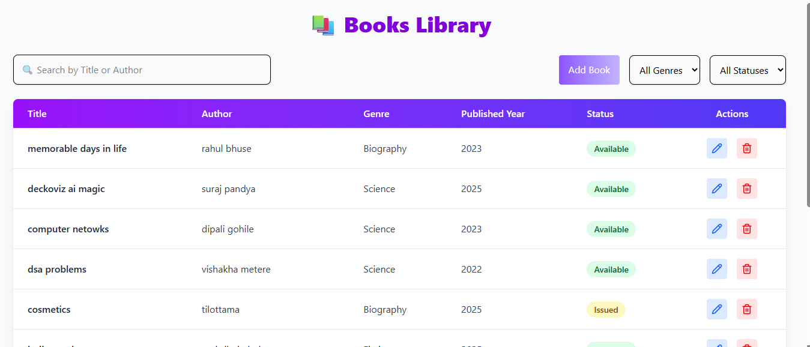
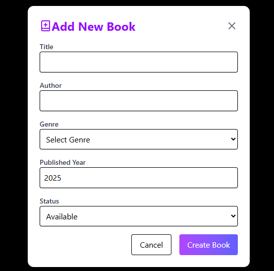
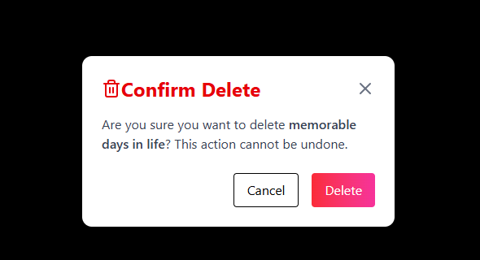

 tools used :
 lucid react  for icons
 redux toolkit and useState for state management 
 design framework : tailwind css
 react-hook-form for form validation
 react-loading-skeleton : for render loading state
 react-toastify : for showing toast success,error with customization
 axios : for api integration

 screenshots
 
 
 
 
